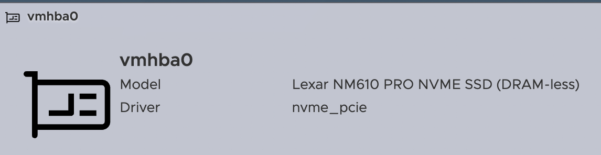
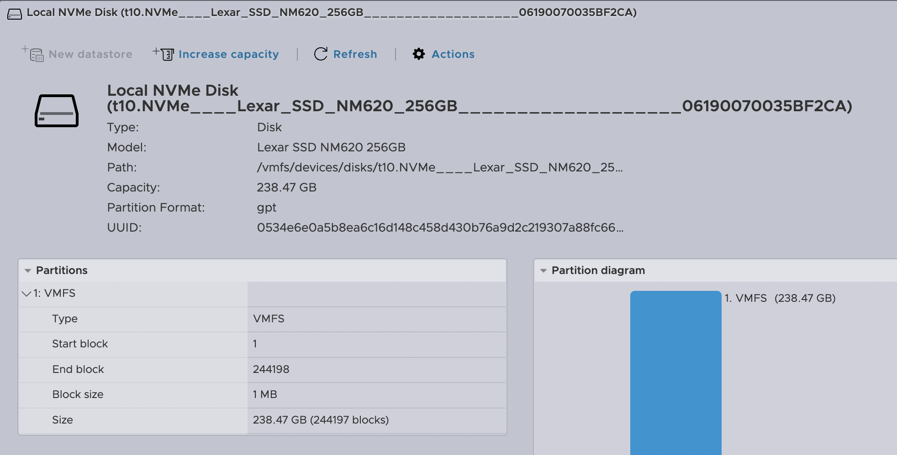

# Raspberry Pi 5 NVMe transport adaptation for ESXi-Arm

**[English](#english) | [Русский](#русский) | [Releases](https://github.com/Soulveig/esxi-driver-nvme-rpi5/releases)**

> **Build-specific CommunitySupported package.** This release replaces VMware's
> `nvme-pcie` VIB and supports only ESXi-Arm 8.0U3c build 24449057. Disable
> Secure Boot and preserve console access plus a tested bootbank rollback.

## English

### What it does

On the validated Raspberry Pi 5 ACPI path, ESXi detects the external PCIe NVMe
controller but cannot allocate MSI-X and does not receive usable legacy INTx
completions. Controller Identify consequently times out and no NVMe HBA appears.

This package is a narrow adaptation of the stock VMware `nvme_pcie` transport.
It retains the original NVMe protocol, DMA, queue and device-identification
implementation while adding bounded completion processing:

- admin commands use bounded inline CQ processing during early registration;
- asynchronous IO gets one serialized CQ pass after submission;
- the lifecycle timer performs up to eight additional passes only while it is
  consuming completions;
- `vmknvme_compl_world_type=1` supplies the completion world used by the tested
  path;
- no unbounded or CPU-capturing busy poll is used.

### Validated configuration

| Component | Configuration |
| --- | --- |
| Board | Raspberry Pi 5 Model B Rev 1.1 |
| Hypervisor | ESXi-Arm 8.0U3c build 24449057 |
| SSD | Lexar NM620 256 GB, PCI `1d97:1202`, firmware `SN15117` |
| PCIe | Gen2 x1 |
| Datastore | GPT + VMFS6 |
| Package | `nvme-pcie 1.2.4.15-2vmw.803.0.55.24449057` |

The release VIB was installed through BootBankInstaller and cold-booted. The
controller created `vmhba0`; VMFS mounted automatically; a 4 GiB write/read
returned MD5 `c9a5a6878d97b48cc965c1e41859f034`; a separate post-package 256 MiB
write/read also matched; failed reads and writes remained zero. No NVMe timeout,
reset, abort, heartbeat NMI, exception or panic occurred in the release check.

### Visual confirmation / Визуальное подтверждение



`vmhba0` is present and attached to the `nvme_pcie` driver. The adapter page
shows `NM610 PRO` because ESXi uses the generic PCI ID description for
`1d97:1202`; the device page below reports the actual tested model, Lexar
NM620 256 GB.

`vmhba0` присутствует и использует драйвер `nvme_pcie`. На странице адаптера
показано `NM610 PRO`, потому что ESXi использует общее описание PCI ID
`1d97:1202`; на странице самого устройства ниже указана фактическая проверенная
модель — Lexar NM620 256 ГБ.



The Lexar NM620 is exposed as a 238.47 GB local NVMe disk. ESXi sees its GPT
layout and the VMFS partition occupying the device, confirming that the disk
is available for VMFS storage.

Lexar NM620 определяется как локальный NVMe-диск объёмом 238,47 ГБ. ESXi видит
разметку GPT и раздел VMFS на всём доступном пространстве, что подтверждает
работу диска как VMFS-хранилища.

### Installation

Use the offline bundle and perform a dry run first:

```console
esxcli system module parameters set -m vmknvme -p 'vmknvme_compl_world_type=1'
esxcli software vib install -d /tmp/nvme-pcie-rpi5-1.2.4.15-2vmw.803.0.55.24449057-offline-bundle.zip --dry-run --no-sig-check --force
esxcli software vib install -d /tmp/nvme-pcie-rpi5-1.2.4.15-2vmw.803.0.55.24449057-offline-bundle.zip --no-sig-check --force
reboot
```

The dry run must select only `BootBankInstaller`, install only Soulveig
`nvme-pcie`, remove only VMware `nvme-pcie`, and require a reboot.

After reboot:

```console
esxcli software vib list | grep nvme-pcie
esxcli storage core adapter list | grep nvme
esxcli storage filesystem list
```

### Limitations and rollback

- only build 24449057 is supported;
- MSI-X/INTx routing is not fixed; completions use a bounded software path;
- one completion world limits scaling and performance remains below the Gen2
  x1 link ceiling;
- other NVMe controllers and Raspberry Pi firmware versions are unvalidated.

Do not install without a known-good bootbank copy and physical console access.
The host-tested timer-only rollback payload is not a substitute for VMware's
original VIB; preserve both before installation.

## Русский

### Что делает пакет

В проверенной ACPI-конфигурации Raspberry Pi 5 ESXi видит внешний PCIe NVMe,
но не может выделить MSI-X и не получает рабочие legacy INTx completion.
Команда Identify Controller завершается по таймауту, поэтому NVMe HBA не
создаётся.

Пакет является узкой адаптацией штатного транспорта VMware `nvme_pcie`.
Исходные NVMe-протокол, DMA, очереди и определение устройства сохранены.
Добавлена ограниченная обработка completion queue:

- admin-команды обрабатывают CQ ограниченно и синхронно во время регистрации;
- после отправки асинхронного IO выполняется один сериализованный проход CQ;
- lifecycle timer повторяет проход не более восьми раз и только пока реально
  снимает completion;
- проверенный путь использует completion world с
  `vmknvme_compl_world_type=1`;
- не используется неограниченный busy-poll, захватывающий CPU.

### Проверенная конфигурация

| Компонент | Конфигурация |
| --- | --- |
| Плата | Raspberry Pi 5 Model B Rev 1.1 |
| Гипервизор | ESXi-Arm 8.0U3c build 24449057 |
| SSD | Lexar NM620 256 ГБ, PCI `1d97:1202`, firmware `SN15117` |
| PCIe | Gen2 x1 |
| Datastore | GPT + VMFS6 |
| Пакет | `nvme-pcie 1.2.4.15-2vmw.803.0.55.24449057` |

Релизный VIB установлен через BootBankInstaller и проверен после холодной
загрузки. Контроллер создал `vmhba0`, VMFS смонтировался автоматически,
запись/чтение 4 ГБ вернула MD5 `c9a5a6878d97b48cc965c1e41859f034`.
Дополнительная проверка 256 МБ после установки пакета также совпала. Ошибок
чтения и записи, NVMe timeout/reset/abort, heartbeat NMI, exception и panic нет.

### Установка

```console
esxcli system module parameters set -m vmknvme -p 'vmknvme_compl_world_type=1'
esxcli software vib install -d /tmp/nvme-pcie-rpi5-1.2.4.15-2vmw.803.0.55.24449057-offline-bundle.zip --dry-run --no-sig-check --force
esxcli software vib install -d /tmp/nvme-pcie-rpi5-1.2.4.15-2vmw.803.0.55.24449057-offline-bundle.zip --no-sig-check --force
reboot
```

Dry-run должен выбрать только `BootBankInstaller`, установить только Soulveig
`nvme-pcie`, удалить только VMware `nvme-pcie` и потребовать перезагрузку.

### Ограничения и откат

- поддерживается только build 24449057;
- маршрутизация MSI-X/INTx не исправлена, используется ограниченный программный
  путь обработки completion;
- единственная completion world ограничивает масштабирование и скорость пока
  ниже предела Gen2 x1;
- другие NVMe и версии прошивки Raspberry Pi не проверялись.

До установки сохраните оригинальный VIB VMware, рабочий bootbank и доступ к
физической консоли.

## Files / Файлы

- `nvme-pcie-rpi5-1.2.4.15-2vmw.803.0.55.24449057-offline-bundle.zip` — recommended offline depot / рекомендуемый offline bundle;
- `nvme-pcie-rpi5-1.2.4.15-2vmw.803.0.55.24449057-community.vib` — standalone unsigned VIB / отдельный неподписанный VIB;
- `SHA256SUMS` — checksums / контрольные суммы.
